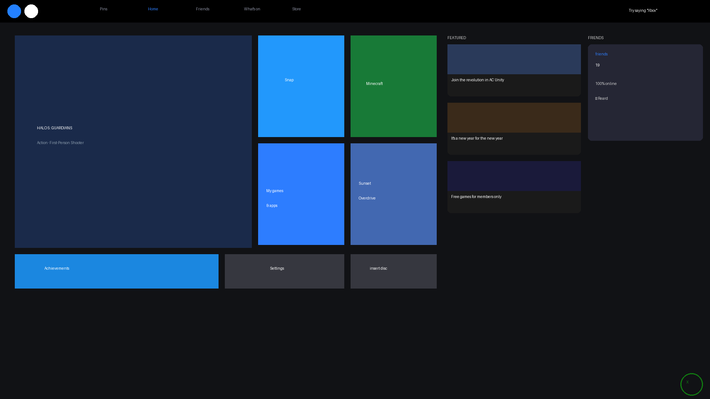
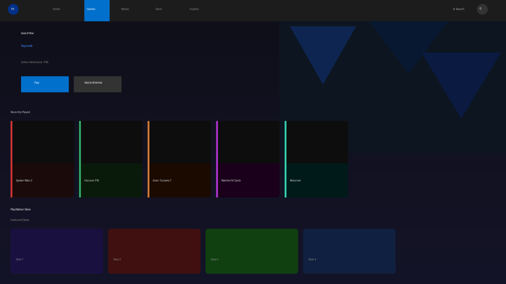
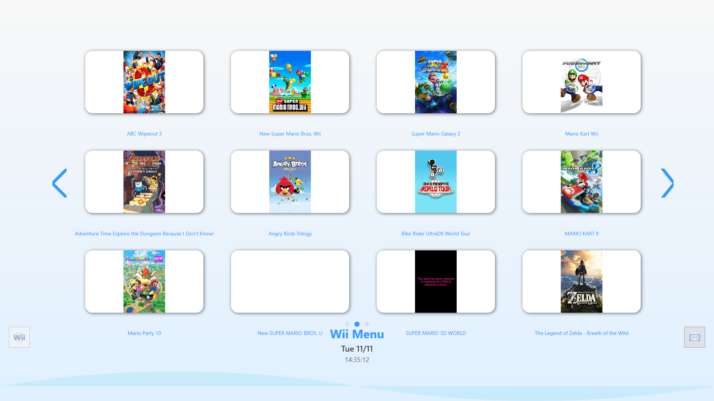

#  "Game OS"

Game OS is a windows c sharp & wpf App made to mange libraries such as games, apps, media and roms!

Game OS has a varity of features to make a windos pc feel like a games console without "Steam Big Picture" 

This Project can be used to replace explorer.exe for a better experince but can also be ran as it is

## Designs

### Xbox One OS

### PS5 OS

### Wii OS

